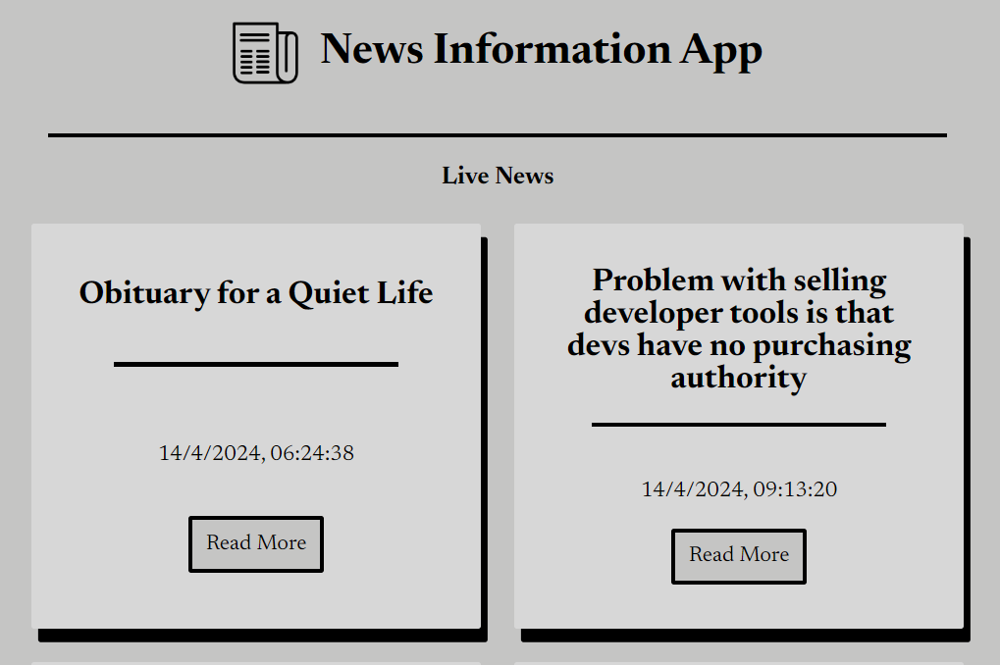

# NewsInformationApp

You can try here the app: [link](https://newsinformationapp.netlify.app)

## Description

News Information App, is a
web app where you can find daily news from the world of tech.

## functionality

On the site opens, it will show you 10 news taken from the [Hacker News API](https://github.com/HackerNews/API).
Every news have their title, date and the link to follow for go into detail.
At the bottom there is a **Load More** button, clicking it the site load 10 more news.

## :books: Lenguages and Tools

- HTML
- CSS
- JavaScript
- Webpack
- Axios
- Lodash
- Dotenv-webpack

## :e-mail: Contacts

Get in touch

- [Linkedin](https://www.linkedin.com/in/antonio-naccarella-31976725a/)
- E-mail: naccarellaantonio25@gmail.com
